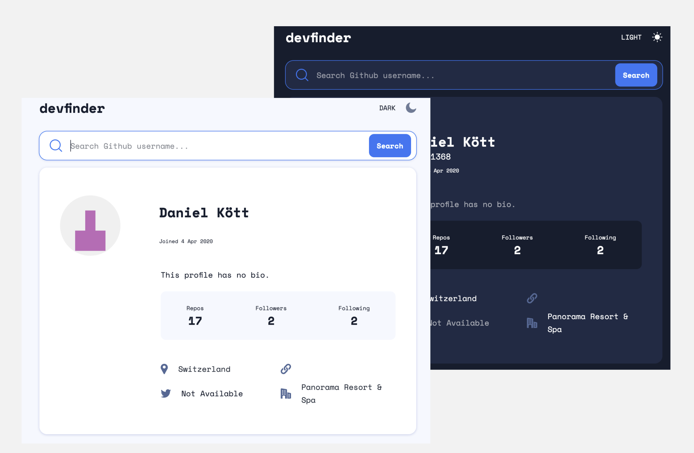

# Frontend Mentor - GitHub user search app solution

This is a solution to the [GitHub user search app challenge on Frontend Mentor](https://www.frontendmentor.io/challenges/github-user-search-app-Q09YOgaH6). Frontend Mentor challenges help you improve your coding skills by building realistic projects.

## Overview

### The challenge

Users should be able to:

- View the optimal layout for the app depending on their device's screen size
- See hover states for all interactive elements on the page
- Search for GitHub users by their username
- See relevant user information based on their search
- Switch between light and dark themes
- **Bonus**: Have the correct color scheme chosen for them based on their computer preferences.

### Screenshot

### Links

- Solution URL: [Add solution URL here](https://your-solution-url.com)
- Live Site URL: [Add live site URL here](https://your-live-site-url.com)

## My process

### Built with

- Semantic HTML5 markup
- SASS with partials
- Flexbox
- CSS Grid
- Mobile-first workflow
- vanillaJS

### What I learned

As I am currently following a javascript course online, I try to apply what I have learned through these projects.

In this one, my main focus was to work on my async/await function. I learned to create an async function to fetch data from the github api, to return a bunch of data to be then displayed on screen.

This function takes in a parameter which is the value of what the user wrote in the searchbar.
Is the user non-existent, I was able to incorporate a check to display a custom error on screen that no result was found.

I also learned to work with the DOM, as there were many elements to be updated through the fetched data.
Some of them needed to be modified depending on whether or not the fetched value returned "null".
A custom message of "not available" needed to be updated on the up.

I was not aware of the @media (prefers-color-scheme) feature before and this was my first time to use it.
I learned in JS how to check if the user's browser had a preferred color-scheme set, and update the conents color automatically.
